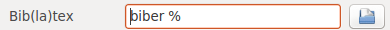

# LaTeX article example

Simple LaTeX file dedicated for university assignments.

## How to use it?

1. [Install TeXLive and biber](#installation)
2. [Clone this repo to your disk](#clone)
3. [Open and compile project](#compile)
4. Have great fun :)

### <a name="installation"></a> Install TeXLive and biber

**Linux**

For Debian/Ubuntu/Mint distros:

```
sudo apt-get install texlive-full biber
```

**Windows**

Install free MikTeX ([download webpage](http://miktex.org/))


### <a name="clone"></a> Clone repository to your disk

**Linux**

- Use `git`
```
cd /to/your/directory/
git clone git@github.com:egel/uek-article-example.git
```

- Download manually by *download* button (on the bottom of right menu bar).


**Windows**

Download this repo by *download* button (on the bottom of right menu bar).

### <a name="compile"></a> Open and compile project

Open (or install) some editor which support LaTeX (for example [Texmaker editor](http://www.xm1math.net/texmaker/download.html))

**Simple configuration of biber in Texmaker:**

> To use `biber` package need to configure Texmaker. So open Texmaker's:

> `Preferences` > `Commands`: and change Bib(la)tex field to: `biber %`

> 


**Set Master file:**

Open `document_main.tex` (it's a main document in this repo) and set document as root file. So open main menu: Preference > "Set current file as Master document"


**Next (in Texmaker) compile 4 times like below:**

- quick compile [F1] shortcut; This compile Master file
- quick compile [F1]
- Bibtex [F11] shortcut; Acctualy it use biber after reconfiguration
- quick compile [F1]

Have fun with this simple example :)
